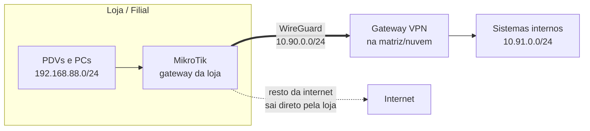

# Filial conectada por WireGuard num MikroTik

Receita completa pra conectar uma **filial/loja** à rede interna da empresa usando **RouterOS 7 + WireGuard**, com **split-tunnel** (só tráfego interno passa pelo túnel), **split-DNS** (domínio interno resolve dentro do túnel) e **NAT na saída** — o pacote que uma operação de varejo multi-loja realmente precisa.

> Contexto: numa rede de lojas, o PDV e os sistemas internos precisam falar com a matriz com segurança, mas a internet da loja não pode depender do túnel — e ninguém quer manter appliance caro em cada filial. Um MikroTik de entrada + WireGuard resolve por uma fração do custo. Esta é a receita que uso em produção nas minhas lojas.

## Topologia



## O que a receita entrega

| Requisito | Como |
|---|---|
| Loja alcança os sistemas internos | rota das redes internas pelo túnel |
| Internet da loja não depende da VPN | split-tunnel: só o interno roteia pelo túnel |
| `sistema.interno` resolve na loja | split-DNS: regra de forward só pro domínio interno |
| Servidores enxergam a loja com um IP só | NAT (masquerade) da LAN na saída do túnel |
| Túnel sobrevive a NAT de provedor | `persistent-keepalive=25s` |
| Queda de link | porta WAN2 livre pra contingência 4G (failover) |

## Passo a passo

### 1. Gere o túnel no MikroTik

```routeros
/interface wireguard add name=wg-matriz listen-port=13231 comment="VPN matriz"
```

O RouterOS gera o par de chaves. Copie a **chave pública** da interface (`/interface wireguard print`) e cadastre no gateway da matriz com o IP desta filial (ex.: `10.90.0.10/32`).

### 2. Aplique o script

Edite as variáveis no topo de [`filial-vpn.rsc`](filial-vpn.rsc) e cole no terminal do MikroTik. O script cria: endereço da VPN, peer do gateway, rotas internas, split-DNS, NAT e firewall.

### 3. Teste

```routeros
/interface wireguard peers print   # last-handshake tem que estar rodando
/ping 10.91.0.1                    # um servidor interno
:put [:resolve sistema.interno]    # split-DNS respondendo
```

## Troubleshooting de campo (aprendido do jeito difícil)

| Sintoma | Causa real | Fix |
|---|---|---|
| Trocou o roteador da loja e "os PCs ficaram sem internet" | lease DHCP antigo preso nos PCs (ou IP fixo da rede velha) | reiniciar o PC ou renovar DHCP (`ipconfig /release && ipconfig /renew`); conferir que o IPv4 voltou como `192.168.88.x` |
| Handshake não fecha | porta bloqueada no provedor / endpoint errado | conferir `endpoint-address:porta`, testar de outra rede; keepalive 25s já contorna NAT comum |
| `*.interno` não resolve no Windows | cache DNS local | `ipconfig /flushdns`; conferir que o DNS do DHCP aponta pro MikroTik |
| Resolve mas não conecta | rota faltando pra rede do serviço | a rede de destino precisa estar em `allowed-address` do peer E nas rotas |
| Tudo caiu com a internet da loja | sem contingência | chip 4G num modem USB/roteador secundário com failover pra WAN2 |

## Segurança

- O firewall do script só aceita, vindo do túnel, tráfego da rede da VPN — a LAN da loja não fica exposta.
- Cada filial tem seu par de chaves; revogar uma loja = remover um peer no gateway.
- Nada de porta de gerência exposta pra internet: Winbox/SSH só pela VPN.

## Licença

MIT — use, adapte, monte sua rede.
